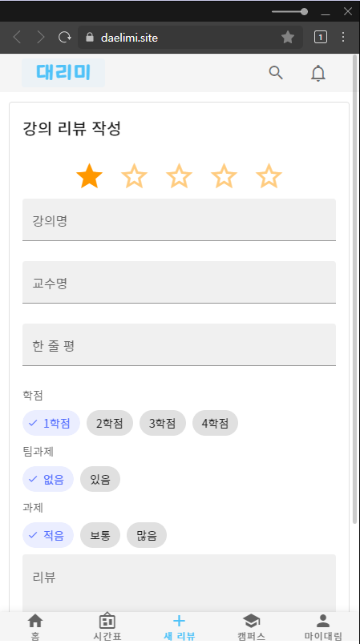
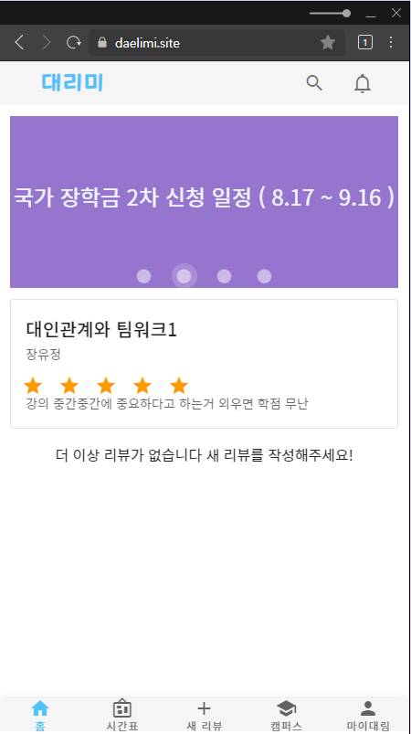
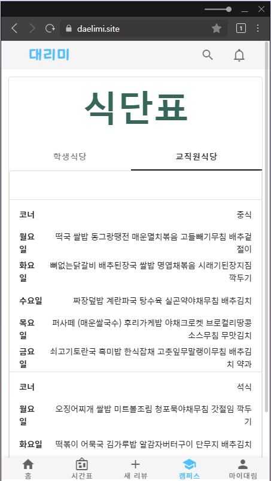
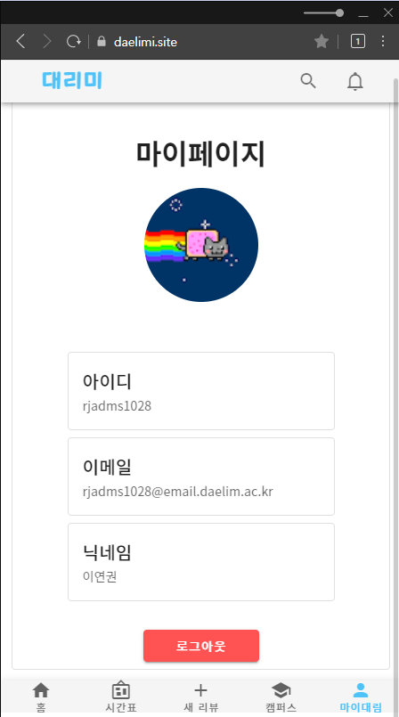
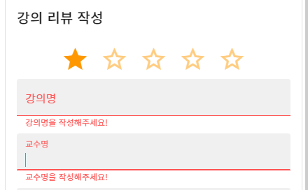

<h1 align="center">Daelimi</h1>
<p align="center">
대림대학교 강의리뷰 서비스
</p>

<br/>

<div align="center">
    
    
    
    
    
    
    
</div>

<br/>
<br/>

<p align="center">아이디: admin, 비밀번호: 123456</p>

<br/>
<br/>
<div align="center">
    
    
    
    
</div>

<br/>
<br/>

## Build Setup

```bash
# install dependencies
$ npm install

# serve with hot reload at localhost:3000
$ npm run dev

# build for production and launch server
$ npm run build
$ npm run start

# generate static project
$ npm run generate
```

For detailed explanation on how things work, check out the [documentation](https://nuxtjs.org).

<br/>
<br/>

## 모바일 기준 UI/UX

대부분의 사용자가 모바일 접속이 예상되기 때문에 모바일 기준으로 Vuetify를 사용하여 반응형으로디자인 하였습니다.

<br/>
<br/>

## Validation Check



서버에 잘못된 값이 넘어가지 않도록 javascript 유효성 검사를 하도록 했습니다. ( 로그인, 리뷰작성 등에 적용되었습니다. )

<br/>
<br/>

## Infinite Scroll

스크롤이 페이지 맨 밑에 도달할 때마다 10개씩 강의리뷰를 가져올 수 있도록 하였습니다.

## ERD
[https://www.erdcloud.com/p/2xAPqYbHvQvqZLPQP](https://www.erdcloud.com/p/2xAPqYbHvQvqZLPQP)
